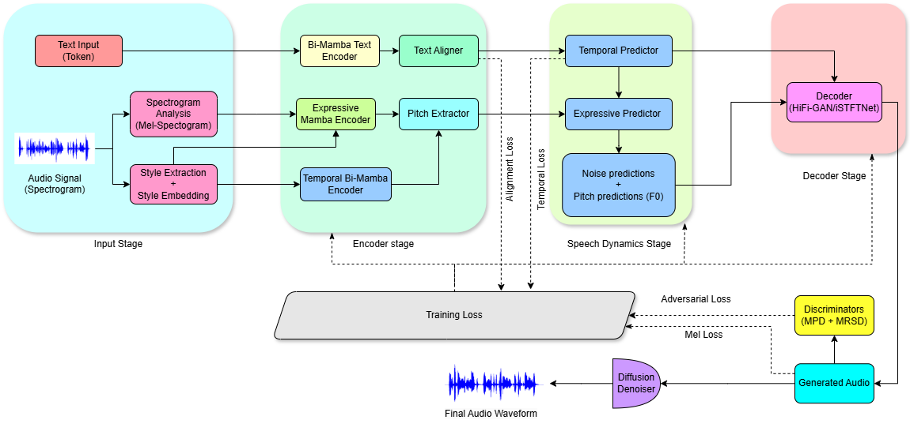

# MambaVoiceCloning (MVC) - Efficient and Expressive TTS with State-Space Modeling

## 📄 Abstract

MambaVoiceCloning (MVC) asks whether the conditioning path of diffusion-based TTS can be made fully SSM-only at inference—removing all attention and explicit RNN-style recurrence layers across text, rhythm, and prosody—while preserving or improving quality under controlled conditions. MVC combines a gated bidirectional Mamba text encoder, a Temporal Bi-Mamba supervised by a lightweight alignment teacher discarded after training, and an Expressive Mamba with AdaLN modulation, yielding linear-time O(T) conditioning with bounded activation memory and practical finite look-ahead streaming. Unlike prior Mamba–TTS systems that remain hybrid at inference, MVC removes attention-based duration and style modules under a fixed StyleTTS2 mel–diffusion–vocoder backbone. Trained on LJSpeech/LibriTTS and evaluated on VCTK, CSS10 (ES/DE/FR), and long-form Gutenberg passages, MVC achieves modest but statistically reliable gains over StyleTTS2, VITS, and Mamba–attention hybrids in MOS/CMOS, F$_0$ RMSE, MCD, and WER, while reducing encoder parameters to 21M and improving throughput by 1.6×. Diffusion remains the dominant latency source, but SSM-only conditioning improves memory footprint, stability, and deployability.

### 🎧 Audio Demos
Explore MVC's expressive and high-quality speech synthesis through our audio samples: [MVC Audio Demos](https://aiai-9.github.io/mvc1.github.io/)


## 🚀 Key Features

* **Efficient State-Space Modeling**: Utilizes Mamba blocks for linear time sequence modeling, significantly reducing computation time and memory overhead compared to traditional self-attention mechanisms.

* **Lightweight Temporal and Spectrogram Encoders**: Includes optimized **BiMambaTextEncoder**, **TemporalBiMambaEncoder**, and **ExpressiveMambaEncoder** with depthwise separable convolutions for reduced parameter count.

* **Dynamic Style Conditioning**: Integrates **AdaLayerNorm** for style modulation, enabling flexible control over prosody and speaker style during synthesis.

* **Advanced Gating Mechanisms**: Employs grouped convolutional gating for efficient residual connections, minimizing parameter overhead while maintaining expressiveness.

* **Optimized Inference Path**: Supports gradient checkpointing and efficient feature aggregation, reducing memory usage during both training and inference.


## 📦 Installation

### Prerequisites

* Python >= 3.8
* PyTorch >= 1.12.0
* CUDA-enabled GPU (recommended for training)
* **Mamba SSM** (Required for Mamba-based encoders)

### Setup

Clone the repository and install dependencies:

```bash
git clone https://github.com/aiai-9/MVC.git
cd MVC
pip install -r requirements.txt
```

### Install Mamba SSM

To install the Mamba SSM module, use the following command:

```bash
pip install git+https://github.com/state-spaces/mamba.git
```

---


### Training

First stage training (Text Encoder, Duration Encoder, Prosody Predictor):

```bash
accelerate launch train_first.py --config_path ./configs/config.yml
```

Second stage training (Diffusion-based decoder and adversarial refinement):

```bash
python train_second_mamba.py --config_path ./configs/config.yml
```

### Inference

Generate high-quality speech with pre-trained models:

```bash
python inference.py --config_path ./configs/config.yml --input_text "Hello, this is MambaVoiceCloning."
```

## 🧠 Model Architecture

MVC consists of three core components:

1. **Bi-Mamba Text Encoder:** Efficiently captures phoneme-level context using bidirectional state-space models (SSMs).
2. **Expressive Mamba Encoder:** Enhances prosodic variation and speaker expressiveness.
3. **Temporal Bi-Mamba Encoder:** Models rhythmic structures and duration alignment for natural speech generation.



## 📊 Evaluation

Run objective and subjective evaluations using provided scripts:

```bash
python evaluate.py --config_path ./configs/config.yml
```

## 🏆 Results

### Table 1: Subjective Evaluation on LibriTTS (Zero-Shot)

| Model          | MOS-N (↑)       | MOS-S (↑)       |
| -------------- | --------------- | --------------- |
| Ground Truth   | 4.60 ± 0.09     | 4.35 ± 0.10     |
| VITS           | 3.69 ± 0.12     | 3.54 ± 0.13     |
| StyleTTS2      | 4.15 ± 0.11     | 4.03 ± 0.11     |
| **MVC (Ours)** | **4.22 ± 0.10** | **4.07 ± 0.10** |

### Table 2: MOS Comparison on LJSpeech (ID vs OOD)

| Model          | MOS\_ID (↑)     | MOS\_OOD (↑)    |
| -------------- | --------------- | --------------- |
| Ground Truth   | 3.81 ± 0.09     | 3.70 ± 0.11     |
| StyleTTS2      | 3.83 ± 0.08     | 3.87 ± 0.08     |
| JETS           | 3.57 ± 0.10     | 3.21 ± 0.12     |
| VITS           | 3.44 ± 0.10     | 3.21 ± 0.11     |
| **MVC (Ours)** | **3.87 ± 0.07** | **3.88 ± 0.09** |

### Table 3: Objective Metrics on LJSpeech

| Model          | F0 RMSE (↓)       | MCD (↓)         | WER (↓)   | RTF (↓)    |
| -------------- | ----------------- | --------------- | --------- | ---------- |
| VITS           | 0.667 ± 0.011     | 4.97 ± 0.09     | 7.23%     | 0.0211     |
| StyleTTS2      | 0.651 ± 0.013     | **4.93 ± 0.06** | **6.50%** | 0.0185     |
| **MVC (Ours)** | **0.653 ± 0.014** | 4.91 ± 0.07     | 6.52%     | **0.0177** |

## 🛠️ Troubleshooting

* **NaN Loss:** Ensure the batch size is properly set (e.g., 16 for stable training).
* **Out of Memory:** Reduce batch size or sequence length if OOM errors occur.
* **Audio Quality Issues:** Fine-tune model hyperparameters for specific datasets.

## 📖 Citation

If you use MVC in your research, please cite:

```bibtex
@inproceedings{kumar2026mambavoicecloning,
  title={MambaVoiceCloning: Efficient and Expressive Text-to-Speech via State-Space Modeling and Diffusion Control},
  author={Sahil Kumar and Namrataben Patel and Honggang Wang and Youshan Zhang},
  booktitle={The Fourteenth International Conference on Learning Representations},
  year={2026},
  url={https://openreview.net/forum?id=0oXyMbPMtP}
}
```

## 📄 License

This project is released under the MIT License. See the LICENSE file for more details.

## 🙌 Contributing

We welcome contributions! Please read the CONTRIBUTING.md file for guidelines on code style, pull requests, and community support.

## 🤝 Acknowledgements

MVC builds on prior work from the Mamba, StyleTTS2, and VITS communities. We thank the authors for their foundational contributions to the field of TTS.

## 📫 Contact

For questions or collaboration, please reach out via GitHub issues or contact us directly at [sahilkumar4ai@gmail.com](mailto:sahilkumar4ai@gmail.com).
